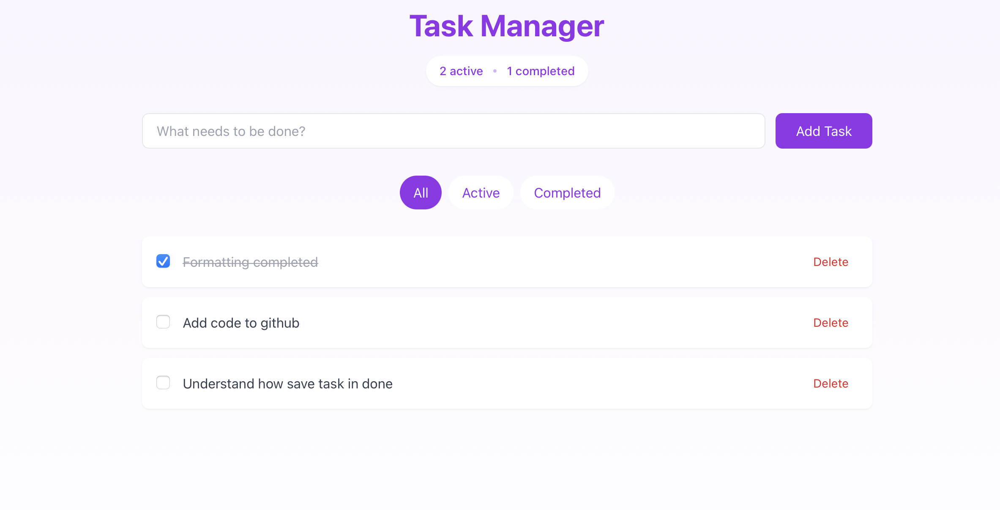

One of the best use cases for agentic is relearn or learn. Todays learning was to see how much time it can take to built a basic tasklist application. It took from start to finish around 30 minutes. 

Here are some ways Agents helped as part of this quick build:
1) Tech stack recommendation
2) Building a basic code framework so i can see how the server starts and how to reach the localhost
3) Take a requirements.md as a requirement and create code from the userstories and acceptance criteria. The requirements was generated by another AI tool. 
4) Taking a 

# Building a Modern Task List Application with Next.js, TypeScript, and Prisma

In this blog post, I'll walk you through the process of creating a full-stack task management application using modern web technologies. The application features a clean, responsive interface and robust backend integration.



## Tech Stack

- **Frontend**: Next.js 14 with TypeScript and Tailwind CSS
- **Backend**: Next.js API Routes
- **Database**: PostgreSQL with Prisma ORM
- **Styling**: Tailwind CSS for modern, responsive design

## Key Features

1. Create, read, update, and delete tasks
2. Filter tasks by status (All, Active, Completed)
3. Real-time UI updates
4. Persistent storage with PostgreSQL
5. Type-safe development with TypeScript

## Project Structure

```
tasklist/
├── src/
│   ├── app/
│   │   ├── api/
│   │   │   └── tasks/
│   │   │       ├── route.ts
│   │   │       └── [id]/
│   │   │           └── route.ts
│   │   ├── page.tsx
│   │   └── layout.tsx
│   ├── lib/
│   │   └── db.ts
│   └── types/
│       └── task.ts
└── prisma/
    └── schema.prisma
```

## Implementation Details

### Database Schema

The Prisma schema defines our Task model:

```prisma
model Task {
  id          String   @id @default(cuid())
  title       String
  completed   Boolean  @default(false)
  createdAt   DateTime @default(now())
  updatedAt   DateTime @updatedAt
}
```

### API Implementation

The application uses Next.js API routes for backend functionality:

1. `GET /api/tasks` - Retrieve all tasks
2. `POST /api/tasks` - Create a new task
3. `PATCH /api/tasks/[id]` - Update task status
4. `DELETE /api/tasks/[id]` - Delete a task

### Frontend Components

The main page component (`page.tsx`) implements:

- Task creation form
- Task list with completion toggles
- Filter controls for task visibility
- Delete functionality with confirmation

## State Management

We use React's built-in `useState` and `useEffect` hooks for state management:

- `tasks` state for storing the task list
- `filter` state for managing task visibility
- `newTaskTitle` state for the input field

## Styling

The application uses Tailwind CSS for styling, providing:

- Responsive design
- Modern, clean interface
- Consistent spacing and typography
- Interactive hover and focus states

## Key Learning Points

1. **Next.js App Router**: Utilizing the latest Next.js features for routing and API handling
2. **TypeScript Integration**: Ensuring type safety across the application
3. **Database Management**: Using Prisma for type-safe database operations
4. **React Patterns**: Implementing proper state management and component structure
5. **API Design**: Creating RESTful endpoints for CRUD operations

## Future Improvements

Potential enhancements for the application:

1. User authentication
2. Task categories/tags
3. Due dates and reminders
4. Task priority levels
5. Real-time collaboration using WebSockets
6. Task search functionality
7. Dark mode support

## Conclusion

This project demonstrates how modern web technologies can be combined to create a robust, full-stack application. The combination of Next.js, TypeScript, and Prisma provides a powerful foundation for building scalable web applications.

You can find the complete source code on [GitHub](https://github.com/vibhusrinivasan/tasklist).

## Getting Started

To run this project locally:

1. Clone the repository
2. Install dependencies: `npm install`
3. Set up your PostgreSQL database
4. Configure your `.env` file with database URL
5. Run Prisma migrations: `npx prisma migrate dev`
6. Start the development server: `npm run dev`

Feel free to contribute or use this project as a starting point for your own applications!